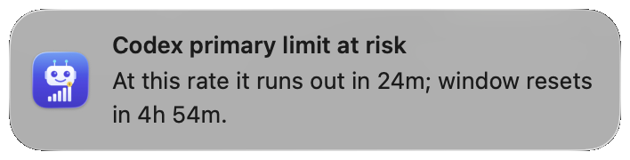
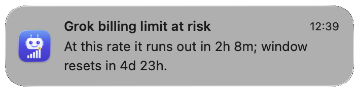
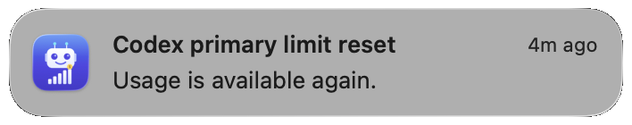
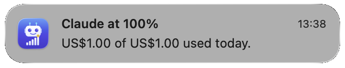
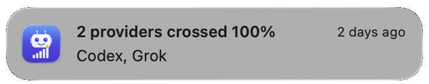

# Agents Usage Bar

[](LICENSE)
[](https://developer.apple.com/macos/)
[](https://swift.org)

A macOS menu bar app showing today's AI agent usage across providers — tokens, USD spent, and quota remaining at a glance.

## Screenshot

<!-- TODO(Phase 6 Plan 06-05): replace this placeholder with a real capture of the menu bar popover. This is awaiting the human-gated screenshot capture in Plan 06-05; do NOT fabricate the image. Expected path: docs/screenshots/menubar-popover.png at ~360pt popover width. -->


_Screenshot pending capture from a release DMG build._

## Notifications

Native macOS banners when a provider crosses a quota threshold, is on pace to exhaust a reset window, or a window rolls over. Toggle each kind in **Settings → Notifications**.

**Pace warning** — current or recent usage would exhaust the window before it resets:





**Limit reset** — a window that was at or above the warning threshold is available again:



**Threshold** — usage crossed the configured quota fraction (default 80%; 100% shown here):



**Coalesced** — several providers crossed the same band on one poll:



## Status

All v1 functionality (Claude, Codex, Gemini, OpenRouter, local LLMs, settings + welcome window) is complete; Phase 6 ships ad-hoc-signed DMG distribution (notarization pending Apple Developer Program enrollment), Sparkle auto-update, and OSS hygiene. See [`.planning/ROADMAP.md`](.planning/ROADMAP.md) for phase-by-phase status.

## Install

Releases are currently **not notarized** by Apple: the project isn't enrolled in the paid Apple Developer Program, so builds are ad-hoc signed.

1. Download the latest `AgentsUsageBar-<version>.dmg` from the [GitHub Releases page](https://github.com/noomz/agents_usage_bar/releases).
2. Open the DMG and drag **AgentsUsageBar** into `/Applications`.
3. Launch it. macOS blocks it the first time ("Not Opened" / "cannot be opened"). Click **Done**, not Move to Trash. Then open **System Settings → Privacy & Security**, scroll down, and click **Open Anyway**. You only need to do this once. Alternatively, run `xattr -dr com.apple.quarantine /Applications/AgentsUsageBar.app`.
4. The menu bar icon (`chart.bar.doc.horizontal`) appears in the top-right of the screen. Click it for the per-provider popover. On first launch, a Welcome window lists which providers were detected and what is still missing.

After that, updates should arrive through **Sparkle**: when a new EdDSA-signed release is published, the app offers to install it the next time it checks the appcast. (v0.1.18 is the first ad-hoc build that launches, so an update from one ad-hoc build to the next has not been tested yet.) The Sparkle public key is pinned in `Info.plist`; see [`docs/entitlements.md`](docs/entitlements.md) for the trust model.

> **Upgrading from v0.1.4–v0.1.17:** those DMGs crashed at launch ([#15](https://github.com/noomz/agents_usage_bar/issues/15)), so they can't auto-update. Download **v0.1.18 or later** by hand and replace the app.

To build and install from source without an Apple certificate, run `scripts/build-local.sh` (it installs to `~/Applications`).

**Requirements:** macOS 14 Sonoma or newer.

## Privacy

**Agents Usage Bar is privacy-first by design.**

- **No telemetry. No analytics. No crash-reporter uploads. All data stays on your machine.**
- Crashes are written only to the local macOS crash reporter.
- The only network traffic the app makes is **outbound HTTPS to the AI provider APIs you have configured** (Anthropic, OpenAI / Codex, OpenRouter, Google Gemini, Ollama Cloud) plus **outbound HTTP to localhost** for the local LLM runtimes you have enabled (Ollama, LM Studio, llama.cpp). Nothing else.
- **Ollama Cloud** (`ollama.com/api/usage`, `/api/me`) is queried only when you have set `OLLAMA_API_KEY` / `[ollama] api_key`, or signed in with `ollama signin`. In the signed-in case the app reads `~/.ollama/id_ed25519` to sign those two requests the same way the `ollama` CLI does; the key is used in memory only — never logged, cached, or sent. From `/api/me` only the plan name is read. Turn it off with the Settings → Providers toggle (immediate) or `[ollama] cloud = false` (next launch); key and `billing_day` edits apply on the next poll.
- **No Keychain UI in v1.** Credentials are read from environment variables and existing CLI config files (e.g. `~/.config/agents-usage-bar/config.toml`, which is created with `0600` permissions and warned about if found world-readable). See SEC-03 in [`.planning/REQUIREMENTS.md`](.planning/REQUIREMENTS.md).

This promise is enforced by a deliberately minimal entitlement posture: the app declares **only** `com.apple.security.network.client` (no library-validation bypass, no JIT, no analytics frameworks). Notarized builds run under the Hardened Runtime; the current ad-hoc releases are signed without it, because it would stop the bundled Sparkle framework from loading ([#15](https://github.com/noomz/agents_usage_bar/issues/15)). See [`docs/entitlements.md`](docs/entitlements.md) for the full why-unsandboxed + what-is-not-declared rationale, and [`SECURITY.md`](SECURITY.md) for the disclosure policy.

(SEC-05 in [`.planning/REQUIREMENTS.md`](.planning/REQUIREMENTS.md).)

## Run from source

**Requirements:**
- macOS 14 Sonoma or newer
- Xcode 16.4 or newer
- An OpenRouter API key — https://openrouter.ai/keys (read-only is sufficient) — and/or signed-in `claude`, `codex`, `gemini` CLIs; and/or a running local LLM runtime (Ollama / LM Studio / llama.cpp)

**Steps:**

1. Open `AgentsUsageBar.xcodeproj` in Xcode.
2. Set the `OPENROUTER_API_KEY` environment variable for the scheme:
   Product → Scheme → Edit Scheme → Run → Arguments → Environment Variables → add `OPENROUTER_API_KEY = <your-openrouter-key>`
3. Press ⌘R to build and run. The menu bar icon (`chart.bar.doc.horizontal`) appears in the top-right of the screen.
4. Click the icon. The popover shows one row per detected provider — USD spent today, tokens, balance, quota bar, and reset time.

If `OPENROUTER_API_KEY` is not set, the app still launches and shows an "OpenRouter — not configured" placeholder row.

**Quit:** Click "Quit Agents Usage Bar" in the popover footer, or press ⌘Q with the popover focused.

## Configuration (optional)

Place a `config.toml` file at `~/.config/agents-usage-bar/config.toml`:

```toml
refresh_interval = "5m"   # 1m, 2m, 5m, 15m, 30m, or manual
threshold = 0.80           # 0.0–1.0 — quota fraction that triggers a warning notification

[openrouter]
api_key   = "<your-openrouter-key>"  # overridden by OPENROUTER_API_KEY env var

[ollama]
# Ollama Cloud usage row — on automatically after `ollama signin` or with a key.
# api_key     = "<your-ollama-key>"  # overridden by OLLAMA_API_KEY env var
# billing_day = 15                   # day of month your included usage resets (shows a countdown)
# cloud       = false                # hide the Ollama Cloud row

[llamacpp]
port = 8080                          # Homebrew / vanilla llama-server only

# Built-in: LM Studio's bundled llama-server (not the Express app server on 1234).
# Matched by binary path under ~/.lmstudio/extensions/backends/
# [engine.lms-llamacpp]
# enabled = true
# port = 8123                        # optional fallback if process discovery misses

# Add more llama.cpp-compatible engines:
# [engine.classifier]
# name = "DRM classifier"
# kind = "llamacpp"
# port = 8123
# # or: match_path = "/path/fragment/in/the/binary"
```

Environment variables take precedence over `config.toml` values (env > toml > defaults).

## Command line (`aub`)

The app binary is also the `aub` CLI. Install it from **Settings → General → Command Line**. The default destination is `~/.local/bin` (XDG user executables; no admin prompt). The picker also offers `/opt/homebrew/bin` and `/usr/local/bin` — the latter is on stock macOS PATH via `path_helper`, but usually needs administrator access.

If you install to `~/.local/bin`, add it to PATH:

```
fish_add_path ~/.local/bin
# zsh/bash: export PATH="$HOME/.local/bin:$PATH"
```

Or symlink yourself:

```
ln -sf "/Applications/AgentsUsageBar.app/Contents/MacOS/AgentsUsageBar" ~/.local/bin/aub
```

```
aub                         # menu-bar cache (same layout as the popover; fast)
aub --live                  # fetch providers now
aub usage --json            # cached snapshot, machine-readable
aub quota claude            # limits + reset windows (cache)
aub settings                # list keys
aub settings get threshold
aub settings set threshold 0.70
aub usage --cached          # same as default; explicit cache read
```

Settings writes go to the same `aub.*` UserDefaults keys as the GUI. API keys are still env / `config.toml` only.

## Build for distribution

Releases are produced by the GitHub Actions release workflow (`.github/workflows/release.yml`) on `v*` tag push: archive → sign with Developer ID → export → DMG via `create-dmg/create-dmg` → notarize via `xcrun notarytool` → staple → EdDSA-sign for Sparkle → publish to GitHub Releases + update appcast on `gh-pages`. The one-time credential provisioning (Apple Developer ID `.p12`, App Store Connect API `.p8`, Sparkle EdDSA key pair, etc.) is documented in [`docs/release-setup.md`](docs/release-setup.md).

For ad-hoc local builds (unsigned):

```bash
xcodebuild build \
  -project AgentsUsageBar.xcodeproj \
  -scheme AgentsUsageBar \
  -configuration Release \
  CODE_SIGN_IDENTITY="" CODE_SIGNING_REQUIRED=NO
```

## Security

To report a vulnerability **privately**, see [`SECURITY.md`](SECURITY.md). Do not file public issues for security reports.

## License

Released under the [MIT License](LICENSE). Copyright (c) 2026 lazym0m3nt@gmail.com.
